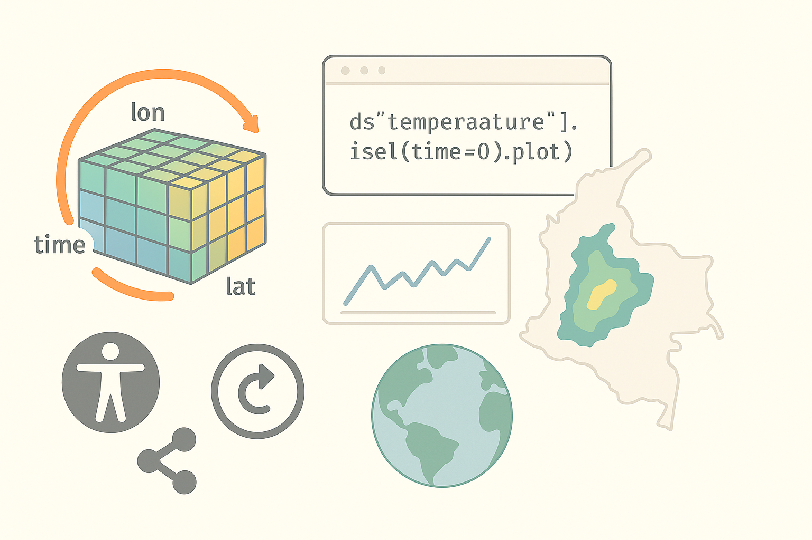
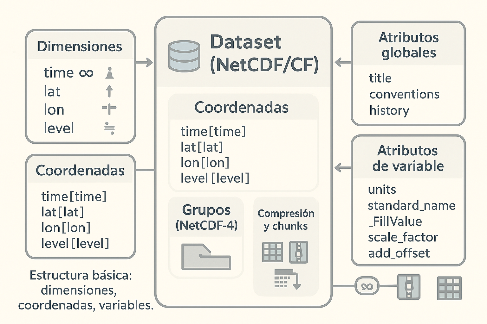
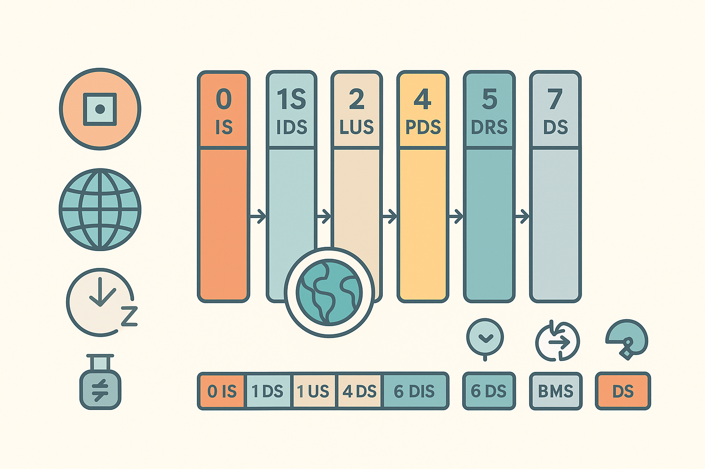

---
jupytext:
  text_representation:
    extension: .md
    format_name: myst
    format_version: 0.13
    jupytext_version: 1.17.3
kernelspec:
  display_name: base
  language: python
  name: python3
---

</img>

+++

# 📘 Exploración de formatos climáticos: NetCDF y GRIB
**Curso AtmosCol-2023 – Cuadernillo Didáctico**

Este cuaderno está diseñado para introducir los dos formatos de archivo más comunes en el análisis de datos meteorológicos y climáticos: **NetCDF** y **GRIB**. Está pensado para ser completado en aproximadamente 20 minutos y utiliza exclusivamente Python.

+++

## ✨ Introducción
Los modelos meteorológicos y los satélites generan enormes volúmenes de datos. Estos se almacenan en formatos especializados que permiten eficiencia y flexibilidad. En este cuaderno aprenderás a reconocer, leer y explorar los formatos **NetCDF** y **GRIB** usando Python. Estos conocimientos son esenciales para cualquier persona que trabaje en ciencia del clima, meteorología operativa o análisis satelital.

+++

## ⚙️ Prerrequisitos
Este cuaderno requiere conocimientos básicos de Python y las siguientes librerías:

```python
import xarray as xr
import matplotlib.pyplot as plt
# Para archivos GRIB
# pip install cfgrib
```

+++

## 📦 Formato NetCDF
**NetCDF (Network Common Data Form)** es un formato de archivo binario auto-descriptivo ampliamente utilizado en las ciencias atmosféricas.

### 📊 Estructura
</img>

+++

### 🔍 Características principales
- Almacena datos multidimensionales (tiempo, latitud, longitud, nivel)
- Permite metadatos descriptivos
- Soporta estructuras jerárquicas (NetCDF-4)

+++

### ✅ Ventajas
- Fácil de explorar con `xarray`
- Compatible con muchas herramientas científicas
- Ideal para almacenamiento a largo plazo

+++

### ⚠️ Desventajas
- Tamaño de archivo mayor comparado con GRIB
- Puede ser más lento para acceso puntual

+++

### 🔄 Versiones
- **Classic**: estructura simple y universal
- **NetCDF-4**: permite compresión y grupos jerárquicos

+++

### 🛠️ Tips ETL en Python
- Usa `ds.sel()` y `ds.isel()` para filtrar por dimensión
- Verifica unidades (`ds.attrs`, `ds.variable.attrs`)
- Asegura el formato de fechas (`time` en UTC)

```{code-cell}
# Lectura básica NetCDF
ds = xr.open_dataset('datos/ejemplo.nc')
ds
```

```{code-cell}
# Visualización de una variable
ds['nombre_variable'].isel(time=0).plot()
```

## 📦 Formato GRIB
**GRIB (GRIdded Binary)** es un formato binario eficiente utilizado principalmente para pronósticos numéricos del tiempo.

### 📊 Estructura
</img>

+++

### 🔍 Características principales
- Datos almacenados como registros binarios con encabezados
- Alta eficiencia en tamaño y lectura
- Muy usado por servicios meteorológicos operativos

+++

### ✅ Ventajas
- Tamaño de archivo reducido
- Acceso puntual eficiente
- Ideal para distribución de pronósticos

+++

### ⚠️ Desventajas
- Menos intuitivo que NetCDF
- Requiere herramientas específicas como `cfgrib`

+++

### 🔄 Versiones
- **GRIB1**: formato más simple y aún en uso
- **GRIB2**: admite más metadatos y compresión

+++

### 🛠️ Tips ETL en Python
- Usa `engine='cfgrib'` con `xarray`
- Explora claves con `filter_by_keys` si hay múltiples campos
- Presta atención al paso temporal (`step`), tipo de nivel y superficie

```{code-cell}
# Lectura básica GRIB
ds_grib = xr.open_dataset('datos/ejemplo.grib', engine='cfgrib')
ds_grib
```

```{code-cell}
# Visualización de una variable
ds_grib['nombre_variable'].isel(time=0).plot()
```

## 📊 Comparación general
| Aspecto        | NetCDF                    | GRIB                      |
|----------------|-----------------------------|----------------------------|
| Compresión     | Opcional (NetCDF-4)         | Alta (GRIB2)               |
| Facilidad de uso    | Más intuitivo               | Más eficiente              |
| Finalidad      | Archivos científicos        | Distribución operativa     |
| Estructura     | Auto-descriptiva            | Encabezados + binario      |

+++

## ✅ Conclusiones
Ambos formatos son esenciales en meteorología. NetCDF es más flexible para análisis y documentación, mientras que GRIB es óptimo para pronósticos y distribución de modelos. Manejar ambos con Python permite construir flujos ETL robustos para proyectos climáticos, energéticos y operativos.

+++

## 📚 Recursos y Bibliografía
- Earth Lab. (s.f.). *Introduction to Climate Data in NetCDF Format*. University of Colorado Boulder. https://www.earthdatascience.org/courses/use-data-open-source-python/hierarchical-data-formats-hdf/intro-to-climate-data/
- ECMWF. (2014). *GRIB – NetCDF: Setting the Scene*. https://www.ecmwf.int/sites/default/files/elibrary/2014/13706-grib-netcdf-setting-scene.pdf
- UCAR Unidata. (s.f.). *NetCDF Documentation*. https://www.unidata.ucar.edu/software/netcdf/docs/
- ECMWF. (s.f.). *GRIB API & ecCodes*. https://confluence.ecmwf.int/display/ECC
